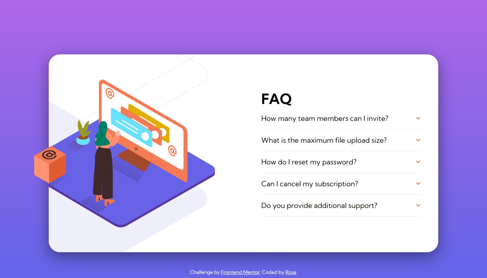

# Frontend Mentor - FAQ accordion card solution

This is a solution to the [FAQ accordion card challenge on Frontend Mentor](https://www.frontendmentor.io/challenges/faq-accordion-card-XlyjD0Oam).

## Table of contents

- [Frontend Mentor - FAQ accordion card solution](#frontend-mentor---faq-accordion-card-solution)
  - [Table of contents](#table-of-contents)
  - [Screenshot](#screenshot)
  - [Links](#links)
  - [Built with](#built-with)
  - [Author](#author)

## Screenshot
- Desktop  
  

- Mobile
 

## Links

- Solution URL: [Solution URL](https://www.frontendmentor.io/solutions/react-vite-styledcomponents-framer-motion-faq-accordion-NCYa1ttVSA)
- Live Site URL: [faq-accordion-card](https://meitung473.github.io/faq-accordion-card/)

## Built with

- Semantic HTML5 markup
- Flexbox
- Mobile-first workflow
- [React](https://reactjs.org/) - JS library
- [Styled Components](https://styled-components.com/) - For styles
- [Vite](https://vitejs.dev/) - fast bundle tools
- [Framer motion](https://www.framer.com/motion/) - React Animation Library

## Author
- Website - [My Blog](https://blog.rosa.tw)
- Frontend Mentor - [@meitung473](https://www.frontendmentor.io/profile/meitung473)

